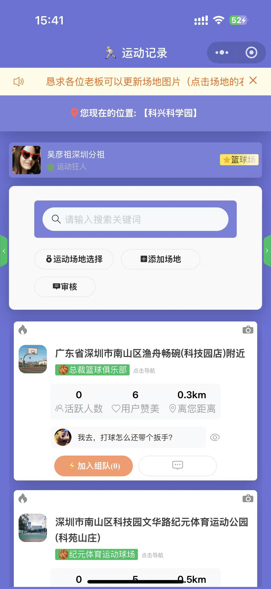
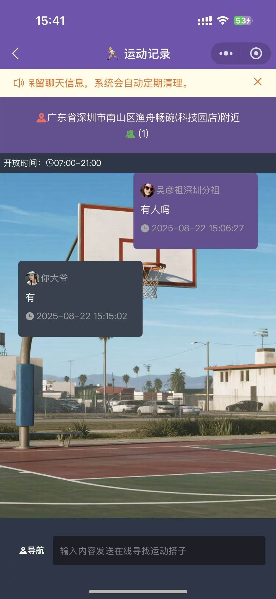

# 🏀 篮球场地约球小程序

> 一款专为运动爱好者设计的微信小程序，帮助用户在陌生城市中快速找到附近运动场所并发起组团运动。

---

## 🌟 项目简介

本小程序旨在为运动爱好者提供一个便捷的场地查询和组团运动平台。用户可以查看附近运动场所的分布、发起/加入组团运动活动、添加新运动场所位置，促进线下交流和运动健康。

---

## ✨ 核心功能

- 📍 附近运动场所定位及展示，如：篮球场/游泳馆
- 🗓️ 发起和参与组团运动活动
- ➕ 添加新运动场所位置
- 💬 聊天

---

## 🛠️ 技术栈

| 技术           | 描述                  |
|----------------|----------------------|
| 微信小程序框架  | 原生开发               |
| 地图 SDK       | 腾讯地图               |
| 后端服务        | Golang |
| 数据存储        | Redis |
| 图片存储        | uniCloud       |

---

## 📸 截图展示

### 首页 - 附近篮球场地图展示

---

### 发起约球

